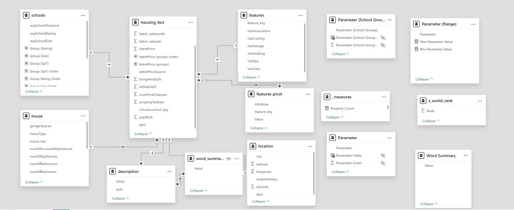
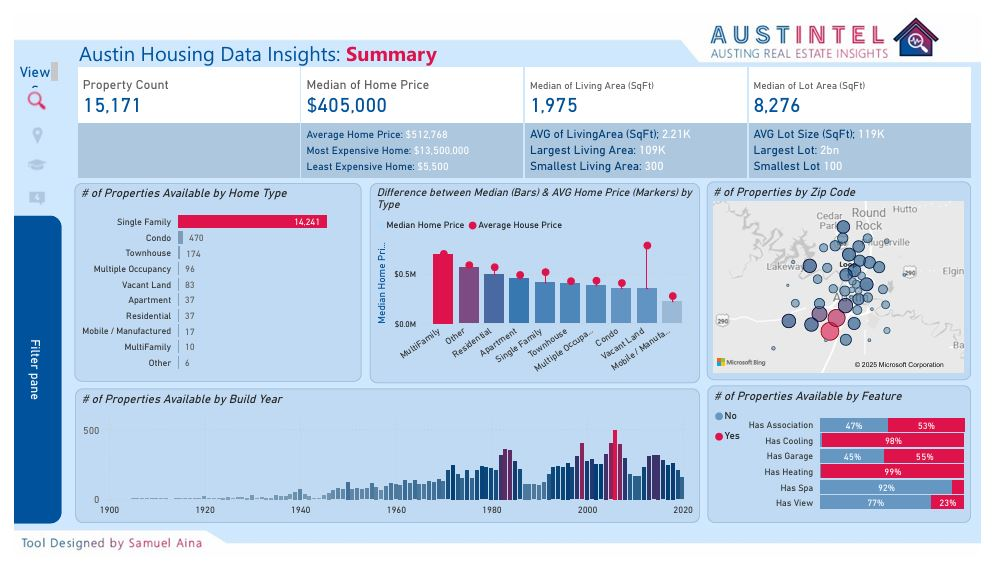
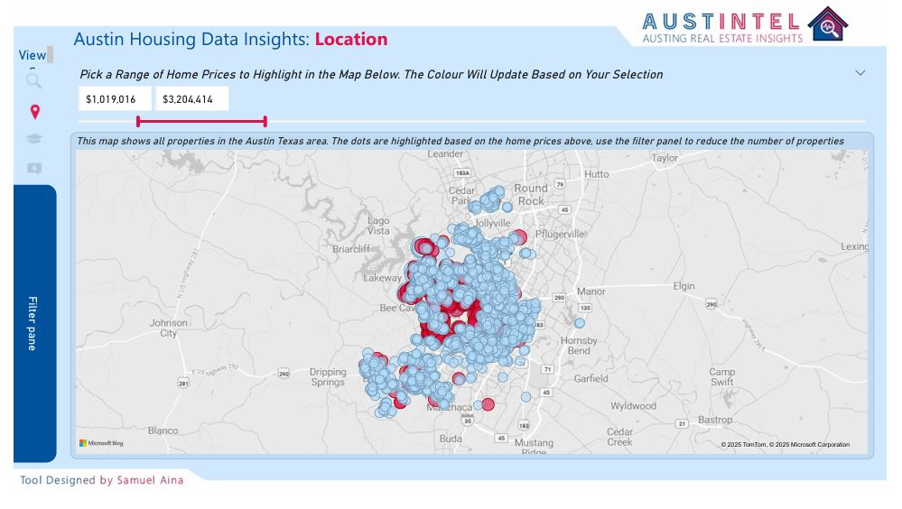
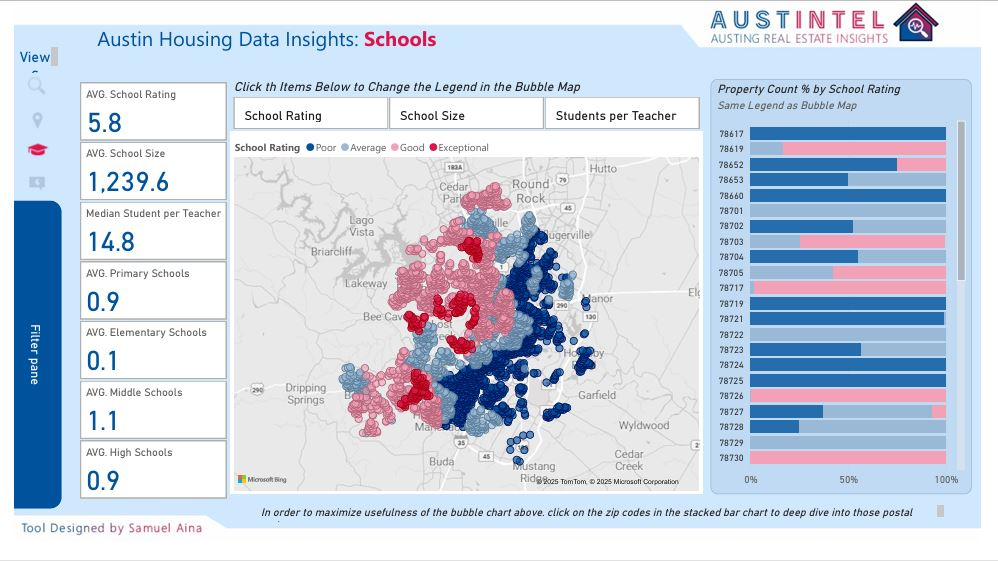
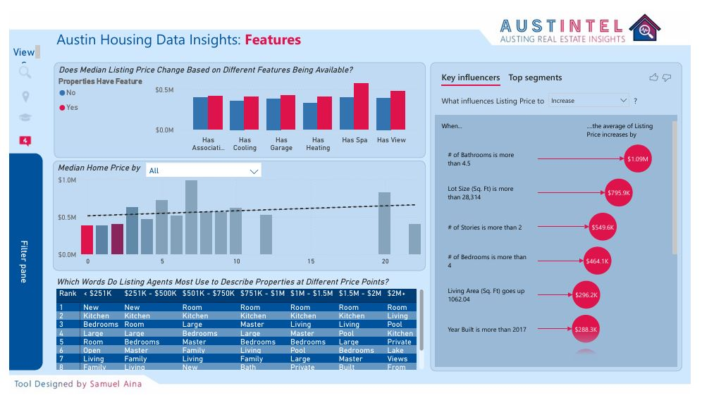

# Austin Housing Data Project

An interactive Power BI dashboard analyzing over 15,000 residential property listings in Austin, Texas. This project dives into real estate trends, educational facilities, geographic patterns, and property features to support data-driven decisions for buyers, sellers, and analysts.

---

## Project Overview

This project demonstrates the full data analysis process using Power BI—from cleaning and modeling to designing insightful, multi-page dashboards.

---

## Skills & Concepts Demonstrated

- **Data Cleaning**: Power Query transformations (text formatting, value replacement, rounding)
- **Data Modeling**: Fact/dimension tables, many-to-many relationships, index creation
- **DAX Measures**: `COUNT`, `AVERAGE`, `SWITCH`, `DISTINCT`, dynamic KPIs
- **Feature Engineering**: Unpivoting, binning, grouping, text analysis
- **Visualization**: Custom visuals, slicers, maps, field parameters, conditional formatting

---

## Problem Statement

The goal is to provide answers to key housing questions:
- What features drive home pricing?
- How do property values vary by location?
- What’s the influence of nearby schools?
- How has the market changed over time?

---

## Data Modeling

- **Fact Table**: Cleaned central housing data
- **Dimension Tables**:
  - `Features`
  - `Schools`
  - `House`
  - `Location`
  - `Descriptions`

- **Joins & Keys**: Multi-column joins with indexing and many-to-many relationships for unpivoted features.

---

## Dashboard Pages

### 1. **Summary Insights**

- KPIs: Median & Average Home Price, Lot & Living Area
- Bar & Line Charts: Home types, price trends, year built
- Map: Bubble size by property count and zip code

### 2. **Location**

- Interactive map with conditional formatting by price range
- Slicers: Year built, size, price
- Dynamic bubble color formatting using DAX

### 3. **Schools**

- School distribution map
- KPIs: Average rating, student size, school type counts
- Bar charts: Grouped by rating, size, and student-teacher ratio
- Field parameter to switch legend view dynamically

### 4. **Features**

- Bar charts: Attribute vs. price or property count
- Field parameters for feature type switching
- DAX-generated “Word Summary” table from listings

---

## Key Insights

- Properties with **pools**, **garages**, and **views** list for higher prices.
- **Post-2017 homes** and homes with **4.5+ bathrooms** attract premium prices.
- **Higher-rated schools** correlate with higher home values.
- **Central and West Austin** have denser and pricier listings.

---

## Conclusion & Recommendations

- **For Buyers**: Consider newer builds and locations with strong schools.
- **For Sellers**: Highlight luxury features in listings.
- **For Analysts**: Expand analysis with time-series or forecast visuals.

---

## Tools Used

- Power BI  
- Power Query  
- DAX  

---
